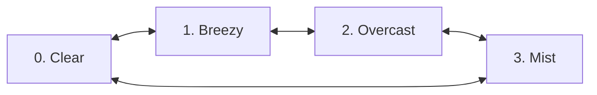

# Weather Simulation Model Specification

## 1. Objective
Define the mathematical simulation model for deterministic weather transitions (`Clear` $\leftrightarrow$ `Breezy` $\leftrightarrow$ `Overcast` $\leftrightarrow$ `Mist`) driven by environmental energy, harmony, recovery, and time of day without random number generators.

## 2. Design Philosophy
Weather in FLOWSTATE is a continuous simulation process that mirrors player flow state. The weather is subtle, calming, and atmospheric—reinforcing The Living Valley's identity.

## 3. Weather State Machine Graph & Hysteresis Thresholds

### Transition Hysteresis Rules
- **Clear $\rightarrow$ Breezy**: Triggers when `environmentalEnergy` $\ge 25.0$ AND `harmony` $\ge 0.5$.
- **Breezy $\rightarrow$ Overcast**: Triggers when `environmentalEnergy` $\ge 50.0$ AND `humidity` $\ge 0.6$.
- **Overcast $\rightarrow$ Mist**: Triggers when `environmentalEnergy` $\ge 75.0$ AND `humidity` $\ge 0.8$.
- **Mist $\rightarrow$ Clear**: Triggers when `recovery` $\ge 0.8$ AND `environmentalEnergy` $< 20.0$.

## 4. Exponential Parameter Interpolation Model
Every parameter $P(t)$ smoothly approaches target $P_{\text{target}}$ per tick $\Delta t$:
$$ P_{t+\Delta t} = P_t + \left(P_{\text{target}} - P_t\right) \times \left(1 - e^{-k \Delta t}\right) $$
where $k = 0.5 \text{ s}^{-1}$.

## 5. Presentation Translation Mapping
- `cloudOpacity` = $\text{cloudCoverage} \times 0.7$
- `fogDensity` = $0.005 + (\text{mistDensity} \times 0.025)$
- `windAnimationStrength` = $0.1 + (\text{windSpeed} / 50.0)$
- `sunVisibility` = $\max(0.1, 1.0 - \text{cloudCoverage})$

## 6. SLAs & Verification Criteria
- **Random Generators**: Strictly **0 calls** to `Math.random()`.
- **Memory Allocation**: **0 bytes** during steady-state tick updates.
- **CPU Time**: $\le 0.2\text{ ms}$ within simulation budget.
