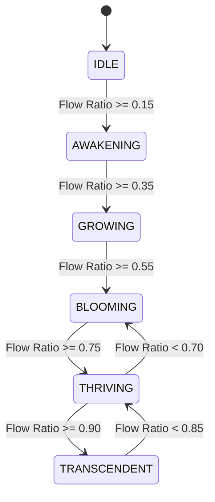

# World State Model & Resonance Cascade Specification

## 1. Objective
Establish the logical 6-state World State Machine and 9-tier Resonance Cascade model. This specification defines how player kinetic flow state is transformed into an environmental state matrix without coupling simulation logic to graphics shaders or audio playback.

## 2. Design Philosophy
The world does not produce player skill; it consumes player skill. The environment reacts to deterministic gameplay signal snapshots, evolving organically as player flow ratio rises and receding gracefully during high-friction or off-track states.

## 3. Current Repository State
- **Completed**: Phase 01.01 Gameplay Signal Architecture (`GameplaySignalSnapshot`), `RESONANCE_MODEL.md`.
- **Partial**: Terrain System 2.0 geometry and splat material prototypes.
- **Missing**: World state engine implementation.
- **Technical Debt**: None in simulation tier.
- **Dependencies**: `shared/src/signals/world-input.ts`, `shared/src/signals/world-state.ts`

## 4. Desired Final Implementation
A purely logical simulation state machine (`Idle` $\rightarrow$ `Awakening` $\rightarrow$ `Growing` $\rightarrow$ `Blooming` $\rightarrow$ `Thriving` $\rightarrow$ `Transcendent`) that consumes `WorldInputSnapshot` via `ResonanceInterpreter` and emits `WorldStateSnapshot` payloads to presentation subscribers.


## 5. Technical Architecture & Mathematical Models

### World State Enum Definitions
```typescript
export enum WorldStateEnum {
  IDLE = 0,         // Flow Ratio < 0.15 (Dark, serene, minimal ambient glow)
  AWAKENING = 1,    // Flow Ratio 0.15 - 0.35 (Soft light shifts, subtle grass emergence)
  GROWING = 2,      // Flow Ratio 0.35 - 0.55 (Vegetation sprouting around ribbon track)
  BLOOMING = 3,     // Flow Ratio 0.55 - 0.75 (Flower blooming, dynamic sky temperature shift)
  THRIVING = 4,     // Flow Ratio 0.75 - 0.90 (Saturated biomes, full audio stem layering)
  TRANSCENDENT = 5  // Flow Ratio > 0.90 (Gold energy auroras, ultimate eco-resonance)
}
\`\`\`

### The 9-Tier Resonance Cascade
When a world state transition occurs, it triggers the 9-tier presentation cascade in order:
1. **Resonance Signal**: Updates `flowRatio` and `resonanceMultiplier`.
2. **Growth State**: Evaluates target vegetation density ($D_{\text{target}} = \text{flowRatio} \times D_{\max}$).
3. **Vegetation**: Spawns GPU instanced grass and flowers along spline margin.
4. **Weather State**: Shifts atmospheric precipitation and cloud opacity.
5. **Lighting**: Interpolates ambient light color temperature ($T_{\text{kelvin}}$).
6. **Wildlife**: Activates ambient particle organisms (butterflies, glowing fireflies).
7. **Music Stems**: Unmutes dynamic background synth stems.
8. **Particle VFX**: Ignites energy ring aura particles.
9. **Atmospheric Fog**: Scales fog density and horizon height fog attenuation.



## 6. Files to Inspect & Modify
- `shared/src/signals/world-state.ts`
- `FLOWSTATE_MASTER_GUIDE/04_LIVING_WORLD_SIMULATION/README.md`

## 7. Files Never Modify
- `frontend/src/core/physics/movement-engine.ts`

## 8. Acceptance Criteria & Quality Gates
- [ ] World state transitions evaluate deterministically from `GameplaySignalSnapshot`.
- [ ] State transitions feature hysteresis thresholds (0.05 flow buffer) to prevent rapid oscillating state flicker.
- [ ] 0-byte memory allocation during state evaluation per frame.

## 9. Performance & Memory Budgets
- Frame Budget: < 0.1ms per tick state evaluation.
- Allocation Budget: 0 bytes per frame.

## 10. Mobile Constraints
- Throttle wildlife particle cascades on Tier 1 low-end mobile GPUs.

## 11. Executable Agent Prompt
```text
Goal: Create shared world state model interface and specification in shared/src/signals/world-state.ts.
Context: Implement 6-state WorldStateEnum and hysteresis state transition logic.
Read First: FLOWSTATE_MASTER_GUIDE/99_PROJECT_MEMORY/DECISION_LOG.md
Files to Inspect: shared/src/signals/
Implementation Plan: Define WorldStateEnum, WorldStateSnapshot interface, and hysteresis constants.
Acceptance Tests: npm run typecheck
```
