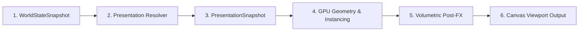

# Render Pipeline & Presentation Isolation Specification

## 1. Objective
Define the isolated 5-stage Presentation Render Pipeline. Ensure graphics rendering, shader parameter updates, GPU instancing, and post-processing FX subscribe cleanly to simulation state snapshots without owning or mutating game rules.

## 2. Design Philosophy
Rendering is a pure consumer of presentation state. Shaders transform vertices, colors, and lighting based on immutable snapshots emitted by the simulation tier.

## 3. Current Repository State
- **Completed**: Babylon.js canvas setup, Terrain System 2.0 splat material prototype.
- **Partial**: Environment view composition.
- **Missing**: Presentation pipeline controller subscribing to `WorldStateSnapshot`.
- **Dependencies**: `shared/src/signals/world-state.ts`, `frontend/src/rendering/`

## 4. Desired Final Implementation
A 6-stage presentation pipeline executing cleanly every frame:

## 5. Technical Architecture

### 6-Stage Render Pipeline
1. **World State Snapshot**: Consumes read-only `WorldStateSnapshot` from simulation tier.
2. **Presentation Resolver**: Translates `WorldStateSnapshot` into declarative `PresentationSnapshot`.
3. **Presentation Snapshot**: Holds declarative rendering values (`skyBlend`, `sunIntensity`, `fogDensity`, `grassDensity`).
4. **GPU Pass**: Executes draw calls for terrain splat mesh and instanced foliage buffers declaratively.
5. **Post-FX Pass**: Applies volumetric bloom, motion blur, and depth of field.
6. **Screen Output**: Flushes frame buffer to WebGL 3D canvas at 60 FPS target.

## 6. Files to Inspect & Modify
- `frontend/src/rendering/environment/environment-view.ts`
- `frontend/src/rendering/canvas-engine.ts`

## 7. Files Never Modify
- `frontend/src/core/physics/movement-engine.ts`

## 8. Acceptance Criteria & Quality Gates
- [ ] Render pipeline contains 0 game simulation logic.
- [ ] Total draw calls remain under 40 per frame.
- [ ] Frame time remains under 16.67ms (60 FPS).

## 9. Performance & Memory Budgets
- VRAM Budget: < 100 MB.
- Draw Calls: < 40 calls.
