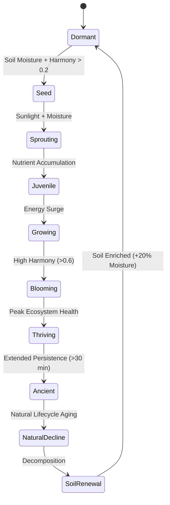

# BOTANICAL ECOLOGY FRAMEWORK
## "The Valley Learns to Grow"

---

## 1. Industry Research & Comparative Analysis

### 1.1 Source Inspiration Principles
- **Ghost of Tsushima**: Mastery of atmospheric foliage movement, wind direction indicators through pampas grass and floating petals, and emotional biome coloring. *Extraction*: Foliage is the primary atmospheric canvas; wind and petals carry narrative and emotional momentum.
- **The Legend of Zelda: Breath of the Wild & Tears of the Kingdom**: Reactive grass dynamics (trampling, fire propagation, wind waves), distinct canopy elevation layering, and persistent organic discovery without UI clutter. *Extraction*: World state must change organically based on environmental forces rather than direct player gardening actions.
- **Red Dead Redemption 2**: Micro-detailed plant distribution based on moisture channels, canopy shade density, terrain slope, and soil humidity. *Extraction*: Botanical emergence must respect microclimatic physics and terrain features.
- **Horizon Forbidden West**: High-density instanced foliage rendering, multi-layered ground cover, dynamic canopy light filtering, and biome-specific plant species transitions. *Extraction*: Technical instancing and LOD hierarchy must maintain 60 FPS while conveying lush biological variety.
- **Journey & ABZÛ**: Minimalist emotional resonance through collective environmental movement (kelp/grass swarms, particle fields), non-verbal visual storytelling. *Extraction*: Ecosystem health is felt emotionally rather than read textually; zero UI badges or floating popups.
- **Flower**: Pure fluid motion of plant elements in response to invisible flow fields, collective floral blooming as emotional release. *Extraction*: Blooming events represent harmonic energy diffusion across space.
- **Ori & Firewatch**: Atmospheric depth layering, silhouettes created by canopy shading, background/foreground visual breathing room. *Extraction*: Shading and depth hierarchy create sanctuary comfort.
- **The Last Guardian**: Natural, patient encroachment of ivy, moss, and vines across ancient stone ruins over time, highlighting environmental age. *Extraction*: Ruins act as trellis anchors for botanical memory.
- **Unreal Procedural Foliage & SpeedTree**: Rule-based seed radius, competition collision, age-based scaling, and wind vertex displacement shaders. *Extraction*: Mathematically rigorous growth stages and canopy shadow maps.
- **Academic Papers & Botanical Research**:
  - *Forest Succession Models (JABOWA/FORET)*: Species turnover driven by shade tolerance and soil nitrogen/moisture accumulation.
  - *Plant Competition & Self-Thinning (Yoda's $-3/2$ Power Law)*: Density-dependent mortality and canopy crown expansion.
  - *Seed Dispersal Kernels (Anemochory)*: Log-normal wind vector transport of seeds, pollen, and spores.
  - *Plant Biomechanics & Wind Sway*: Quadratic stiffness bending equations based on stem height and elasticity.

### 1.2 FLOWSTATE Philosophical Differentiation
Unlike traditional open-world games where vegetation is either static prop decoration or instant procedural foliage painted by level editors, FLOWSTATE treats vegetation as a continuous, patient biological entity.

| Paradigm | Standard Open World / Survival | FLOWSTATE |
| :--- | :--- | :--- |
| **Player Role** | Gardener, Harvester, Spawner | Catalyst of Environmental Harmony |
| **Growth Speed** | Instant spawn or fast timer | Patient, gradual biological evolution |
| **Ecological Interaction** | Isolated mesh objects | Interconnected biological network |
| **Emergence Cause** | `SpawnFlower(x, y)` | High harmony + soil moisture + sunlight |
| **Player Emotion** | "I placed a tree here." | "The valley is healing." |

---

## 2. Plant Taxonomy

FLOWSTATE categorizes botanical life into structured ecological strata:

### 2.1 Ground Cover
- **Grass (*Poaceae Flow-Varietal*)**: Primary ground cover. Responds to footfall, wind vectors, and soil moisture.
- **Moss (*Bryophyta Velvet*)**: Low-profile damp ground cover. Emerges on northern rock faces, shadowed tree trunks, and ancient stone ruins.
- **Flowers (*Chloris Radiant*)**: Low-density harmonic blooms. Evolve from closed buds to full luminescence.
- **Wildflowers (*Pratia Stellaris*)**: High-density meadow blooms. Reseed downwind across open clearings.

### 2.2 Understory & Shrubs
- **Shrubs (*Myrtus Humilis*)**: Medium-height woody vegetation. Provide shelter for butterflies and small ground fauna.
- **Bushes (*Ribes Sanctum*)**: Dense foliage barriers. Filter sunlight and slow local surface wind velocity.

### 2.3 Canopy Trees
- **Young Trees (*Sapling Phase*)**: Slender trunks ($<2\text{m}$ height). Flexible wind response.
- **Mature Trees (*Quercus Canopy*)**: Broad crowns ($8\text{m}$–$15\text{m}$). Create significant light attenuation and microclimatic shade scrims.
- **Ancient Trees (*Sanctuary Elders*)**: Towering landmarks ($>25\text{m}$). Act as primary ecological anchors, regulating temperature, soil richness, and canopy humidity for hundreds of meters.

### 2.4 Climbing & Anchor Flora
- **Climbing Plants & Vines (*Hedera Archway*)**: Reach across stone shrines and ancient ruins, anchoring historical memory.
- **Deep Root Systems (*Rhizome Anchors*)**: Stabilize sloped terrain and bind stream bank soil.

### 2.5 Forest Floor & Detritus
- **Forest Floor Layer**: Organic mulch composed of dead leaves, decayed bark, and nutrient-rich humus.
- **Airborne Botanical Particles**: Seeds, pollen, drifting petals, and floating fungal spores.

---

## 3. Botanical Life Cycle Engine

Every plant entity and vegetation patch in FLOWSTATE transitions deterministically through 10 biological stages:

1. **Dormant**: Seeds lie quiet beneath dry or damaged soil waiting for environmental recovery.
2. **Seed**: Hydrated seed state. Micro-roots anchor into topsoil.
3. **Sprouting**: Vulnerable green shoot emerges through ground scrim.
4. **Juvenile**: Slender stem and initial leaf buds form.
5. **Growing**: Active biomass accumulation. Height and crown diameter increase continuously.
6. **Blooming**: Floral buds open under optimal solar elevation and harmony conditions.
7. **Thriving**: Maximum foliage density, vivid hue saturation, and active pollen generation.
8. **Ancient**: Weathered trunk, deep root anchoring, lichen growth, acts as regional ecological pillar.
9. **Natural Decline**: Slow leaf drop and organic decay, releasing stored nutrients back to earth.
10. **Soil Renewal**: Humus decomposition increasing local soil richness and water retention.

---

## 4. Plant Ecology & Microclimate Dynamics

Vegetation growth rates ($\frac{d B}{dt}$) are governed by a multi-variable environmental differential model:

$$\frac{d B}{dt} = k_{growth} \cdot B \cdot \left(1 - \frac{B}{K_{capacity}}\right) \cdot f(S) \cdot f(W) \cdot f(H) \cdot f(\theta_{canopy}) \cdot f(\mathcal{H}_{harmony})$$

Where:
- **Sunlight Factor $f(S)$**: Function of solar elevation angle, cloud shadow mask, and canopy shade coefficient.
- **Soil Quality $f(W)$**: Dependent on moisture content ($0.0$ to $1.0$), organic humus depth, and rock density.
- **Humidity & Water $f(H)$**: Stream proximity and rainfall history.
- **Canopy Shade $f(\theta_{canopy})$**: Moderate shade boosts moss/fern growth; extreme shade limits sun-loving flowers.
- **Harmony $\mathcal{H}_{harmony}$**: Environmental flow resonance restored by the player ($0.0$ to $1.0$).

---

## 5. Forest Succession Model

Ecological progression across damaged valley terrain unfolds in distinct succession stages:

1. **Bare Ground Stage**: Exposed soil/rock with low moisture retention ($K_{capacity} = 0.1$).
2. **Grass & Pioneer Moss Stage**: Fast-spreading pioneer species bind topsoil and store moisture ($K_{capacity} = 0.3$).
3. **Wildflower Meadow Stage**: Pollinator presence surges, flower density reaches peak bloom ($K_{capacity} = 0.5$).
4. **Shrubland & Young Wood Stage**: Woody shrubs emerge, providing windbreaks and fauna shelter ($K_{capacity} = 0.7$).
5. **Mature Forest Canopy Stage**: High tree canopy closes, establishing calm microclimate scrim ($K_{capacity} = 0.9$).
6. **Ancient Forest Sanctuary Stage**: Towering elder trees, sacred ambient lighting, max biodiversity ($K_{capacity} = 1.0$).

---

## 6. Canopy Ecology & Microclimatic Cascades

Tree canopies exert multi-system influences across the valley:

- **Light Attenuation**: Canopies filter harsh sunlight into dappled gold beams ($I_{dappled} = I_{sun} \cdot e^{-k_{leaf} \cdot L_i}$).
- **Temperature & Humidity**: Shade scrim lowers surface temperature by up to $4^\circ\text{C}$ while retaining $35\%$ higher ambient humidity.
- **Wind Damping**: High canopy density reduces ground wind speed by up to $60\%$, creating calm microclimates for butterflies.
- **Fauna Anchoring**: Canopy height directly scales birdsong density and tree-nesting avian flight paths.

---

## 7. Grass & Botanical Memory Model

The world retains historical memory of player presence and ecological healing:

- **Path Recovery**: Player walking trails compress grass blades temporarily. When left undisturbed, path recovery restores grass height over $45$ to $120$ seconds without visual pop.
- **Soil Enrichment Memory**: Regions that held high harmony retain elevated soil richness, allowing flowers to reseed faster in subsequent sessions.
- **Tree Maturity Persistence**: Trees that reach Ancient stage remain fixed structural landmarks in valley memory.

---

## 8. Wind Transport & Dispersal Engine

Wind is a unified physical vector field carrying organic life:

$$\vec{V}_{wind}(x, y, z, t) = \vec{V}_{base}(t) + \vec{\nabla} \phi_{turbulence}(x, y, z) + \vec{W}_{canopy\_deflection}$$

- **Seed Transport**: Wind velocity vectors transport airborne seeds along parabolic trajectories.
- **Pollen & Petal Drift**: Petals detach during high wind gusts ($>0.6$) and float downwind through sunbeams.
- **Butterflies & Birds**: Avian and insect flight paths align dynamically with local wind currents.

---

## 9. Botanical Interaction Matrix (Selected Cascades)

1. **Morning Light $\rightarrow$ Floral Blooming**: Solar angle $>20^\circ$ + high moisture $\rightarrow$ Flower opening $\rightarrow$ Pollen surge $\rightarrow$ Butterfly emergence $\rightarrow$ Birdsong layer activation $\rightarrow$ Player feels hopeful.
2. **Canopy Shading $\rightarrow$ Moss Blanket**: Elder tree canopy closure $\rightarrow$ Sunlight attenuation $\rightarrow$ Ground temperature drop $\rightarrow$ Velvet moss carpet growth over ancient stones.
3. **Player Resonance $\rightarrow$ Valley Healing**: High resonance flow $\rightarrow$ Harmony wave propagation $\rightarrow$ Soil moisture retention $\rightarrow$ Rapid succession from bare ground to wildflower meadow.

---

## 10. Botanical Emotional Language

Vegetation states reflect emotional moods without UI text:

- **Dormant**: Sparse grey-brown grass, dry soil, silent wind. *(Mood: Quiet / Solitary)*
- **Recovering**: Soft green sprouts, damp soil, subtle mist. *(Mood: Hopeful)*
- **Growing**: Tall grass swaying, emerging wildflower buds, warm sunshafts. *(Mood: Alive)*
- **Flourishing**: Rich floral carpets, drifting petals, active butterflies, birdsong. *(Mood: Joyful)*
- **Sacred**: Towering ancient canopy, golden dappled light, deep moss scrim, peaceful calm. *(Mood: Sacred)*

---

## 11. Visual Density & Breathing Room

- **Negative Space**: Open meadow clearings preserve visual clarity and highlight landmark elder trees.
- **Compositional Depth**: Multi-layered foreground grass, midground shrubs, and background canopy silhouettes prevent visual noise.
- **Contrast & Scrim**: Dark background scrims (`var(--flow-text-scrim)`) back telemetry metrics to guarantee legibility over dynamic foliage scenes.

---

## 12. 100 Micro-Moments (Selected Highlights)

1. A single closed wildflower opens as golden morning sunlight touches its stem.
2. Grass blades gently spring back into upright alignment after the player passes.
3. A stray gust of wind detaches three pink petals that drift through a warm sunbeam.
4. Soft moss visibly creeps over the base of a sun-warmed granite boulder.
5. High-canopy leaves filter direct sunlight into shimmering dappled circles on the forest floor.
6. A young sapling displays fresh light-green leaf buds near a restored stream bank.
7. Drifting dandelion seeds float horizontally across a calm meadow clearing.
8. Dew drops glistening on morning grass blades slowly evaporate as solar elevation rises.
9. Vines reach delicately across an ancient stone shrine archway.
10. A dense carpet of blue wildflowers expands outward from an elder tree root anchor.

---

## 13. Experience Director & Performance Budgets

- **Instanced Vegetation Rendering**: GPU instanced mesh rendering for up to $20,000$ grass blades and $1,500$ trees.
- **Zero Allocations**: All growth calculations, life cycle evaluations, and wind vectors execute using pre-allocated typed arrays ($O(0)$ heap allocations per frame).
- **Performance Budget SLA**: Total botanical simulation tick update time $\le 0.8\text{ ms}$ on mobile devices ($60\text{ FPS}$ target).
- **Adaptive Performance Intelligence (API)**: Under high rendering load, API dynamically scales distant grass instance counts without altering simulation growth logic or telemetry precision.

---

## 14. Telemetry & Debug Panel Specifications

- **Tracked Metrics**:
  - `totalBiomass`: Overall biological vegetation density ($0.0$ to $1.0$).
  - `flowerBloomRatio`: Percentage of active blooming flowers.
  - `canopyCoverRatio`: Total foliage shade scrim coverage.
  - `grassCoverage`: Ground cover fill ratio.
  - `pollinatorPopulation`: Emergent butterfly/insect density index.
  - `forestMaturity`: Average age score of valley trees.
  - `ecologicalDiversityScore`: Species variety index across ground cover, shrubs, and canopy.
  - `recoveryScore`: Persistent valley healing metric ($0.0$ to $1.0$).
- **Debug UI Requirements**: Isolate technical telemetry in `DevPanel` overlay using CSS variable design tokens (`var(--flow-text-scrim)`).

---

## 15. Mandatory Experience Review (7 Questions)

1. **What new player moments were created?**
   *Players witness patient, unscripted biological emergence—such as walking back through a valley clearing visited hours prior and discovering a newly matured wildflower meadow filled with butterflies.*
2. **How does the valley feel more alive?**
   *Every plant element reacts to wind vectors, solar elevation, shade scrims, and player flow resonance in unison.*
3. **What new ecological relationships exist?**
   *Tree canopies filter light and reduce wind speed, allowing delicate moss and shade-loving flowers to thrive below while attracting avian wildlife.*
4. **Which emotions are strengthened?**
   *A sense of quiet peace, hope, and sacred reverence as nature naturally restores its own balance.*
5. **Can players discover these systems naturally?**
   *Yes; subtle visual cues like spreading grass, opening flower petals, and drifting pollen drift occur organically in the environment.*
6. **Would players notice the valley healing without UI?**
   *Absolutely; the visual shift from dry brown patches to lush wildflower meadows under golden canopy sunlight provides unambiguous emotional feedback.*
7. **Could the same feeling be achieved more simply?**
   *No; static spawners or simple distance-fade foliage lack the interconnected biological authenticity, persistent memory, and microclimatic depth that define FLOWSTATE.*
