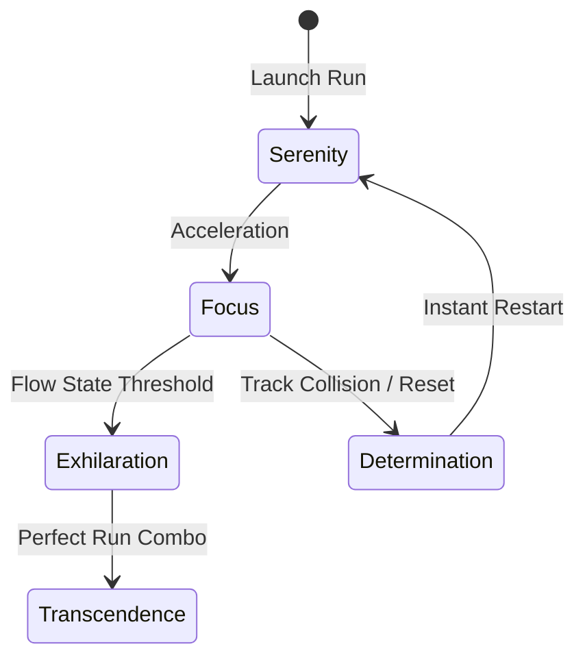

# Emotional Journey & Player Arc

## Player Emotional Arc Mapping

### First Minute
- **Emotion**: Curiosity & Serenity.
- **Experience**: Soft atmospheric audio, clean luminous HUD, smooth acceleration down an open ribbon spline.

### First Session (10-15 Minutes)
- **Emotion**: Exhilaration & Discovery.
- **Experience**: First speed threshold reached; dynamic FOV expands, energy rings ignite, grass and flowers bloom around the track.

### First Hour
- **Emotion**: Focus & Challenge.
- **Experience**: Mastering steep spline curves, timing jumps over track gaps, experimenting with initial passive perks.

### First Week
- **Emotion**: Competence & Pride.
- **Experience**: Unlocking custom sphere materials, achieving top 10% leaderboard runs, mastering biome transitions.

### First Month & Beyond
- **Emotion**: Mastery & Transcendence.
- **Experience**: Seamless flow state runs, zero-error time attacks, participating in seasonal leaderboard events.

## Emotional State Machine Diagram

## Related Canon Documents
- [Player Fantasy.md](Player%20Fantasy.md)
- [Design Vocabulary.md](Design%20Vocabulary.md)
