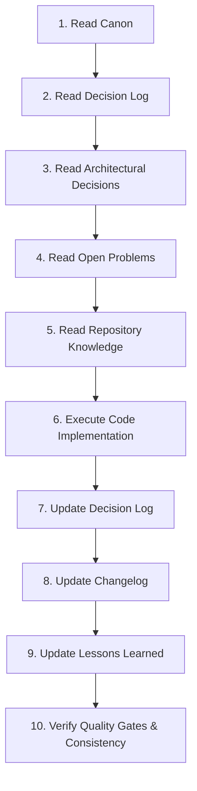

# Mandatory AI Memory Protocol

Every AI agent, subagent, and human engineer **MUST** strictly follow this **10-Step Memory Protocol** for every execution phase. Skipping any step is a protocol violation.

## Protocol Steps
1. **Read Canon**: Review `FLOWSTATE_MASTER_GUIDE/98_CANON/` to align with game vision and laws.
2. **Read Decision Log**: Check `99_PROJECT_MEMORY/DECISION_LOG.md` to prevent re-opening settled decisions.
3. **Read Architectural Decisions**: Review `ARCHITECTURAL_DECISIONS.md` for ADR constraints.
4. **Read Open Problems**: Check `OPEN_PROBLEMS.md` for related open issues.
5. **Read Repository Knowledge**: Review `REPOSITORY_KNOWLEDGE.md` for file maps and entry points.
6. **Execute Code Implementation**: Perform changes adhering strictly to Do-Not-Break rules.
7. **Update Decision Log**: Record any new architectural decisions in `DECISION_LOG.md`.
8. **Update Changelog**: Add entry to `CHANGELOG.md` under active version.
9. **Update Lessons Learned**: Record discoveries or issues in `LESSONS_LEARNED.md`.
10. **Verify Consistency**: Execute `npm run typecheck` and verify 10-Point AI Quality Gate compliance.
