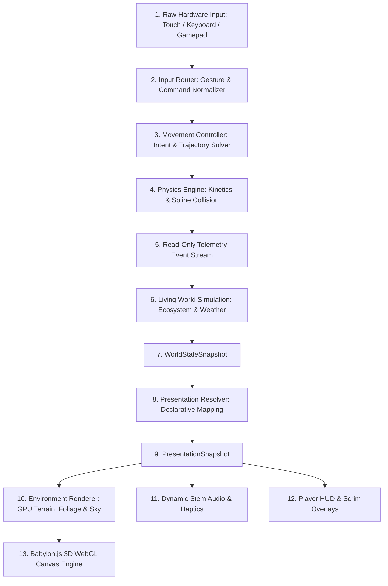

# FLOWSTATE Runtime Architecture Map

This document outlines the runtime data flow and execution hierarchy of the FLOWSTATE game engine. While `DEPENDENCY_GRAPH.md` maps documentation modules, this blueprint details how data flows through system subsystems at runtime.

---

## High-Level Data Flow Architecture

---

## System Tier Breakdown

### Tier 1: Hardware & Input Layer
- **Input Router**: Converts raw pointer, touch, and keyboard events into normalized `MovementIntent` snapshots (`horizontal`, `vertical`, `jumpPressed`).

### Tier 2: Core Physics & Kinetics Layer
- **Movement Controller**: Evaluates intent against spline curvature and surfaces.
- **Physics Engine**: Solves kinetic equations, momentum conservation, gravity multipliers, and collision responses.
- **Telemetry Event Bus**: Dispatches immutable, read-only frame telemetry snapshots (`position`, `velocity`, `currentSpeed`, `flowStateRatio`).

### Tier 3: Simulation & Ecosystem Layer
- **Living World Simulation**: Consumes `flowStateRatio` telemetry to drive eco-resonance growth, foliage blooming, weather transitions, and day/night light temperature.
- **Audio Engine**: Adjusts active stem layers, spatial sound positioning, and haptic feedback based on momentum and ring passes.

### Tier 4: Presentation & Rendering Layer
- **Environment Rendering**: Renders terrain splat materials, GPU-instanced foliage, volumetric bloom, and particle VFX.
- **Player HUD**: Displays speed indicators, objective pills, energy meters, and DevPanel telemetry over dark scrims (`tokens.css`).
- **WebGL Canvas**: Output frame rendered via Babylon.js engine at steady 60 FPS target.

---

## Related Blueprint Documents
- [DEPENDENCY_GRAPH.md](DEPENDENCY_GRAPH.md) — Documentation dependency blueprint.
- [INDEX.md](INDEX.md) — GDOS Master Directory.
