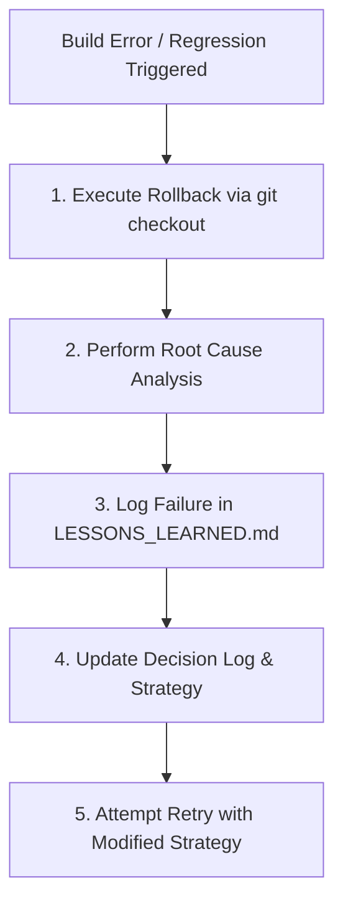

# AI Failure Recovery Protocol

If an implementation phase fails or introduces build errors/performance regressions, execute the following protocol:

## Recovery Steps
1. **Rollback Immediately**: Revert workspace changes using `git checkout HEAD -- [files]`. Do not stack band-aid patches over broken commits.
2. **Analyze Root Cause**: Inspect un-truncated error logs or stack trace files.
3. **Record Lesson**: Add failure entry to `99_PROJECT_MEMORY/LESSONS_LEARNED.md`.
4. **Adjust Strategy**: Refine phase prompt or implementation plan.
