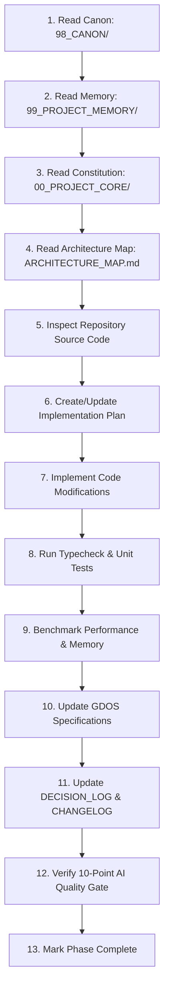

# AI Operating Rules & Execution Protocol

This document establishes the mandatory operating rules for Antigravity IDE, Codex, and all AI agents working on FLOWSTATE.

---

## Mandatory 13-Step AI Execution Workflow

## Operating Rules
1. **Never Skip Memory**: Always check [MEMORY_PROTOCOL.md](../99_PROJECT_MEMORY/MEMORY_PROTOCOL.md) before proposing code modifications.
2. **Respect Protected Files**: Never mutate files listed in [Do_Not_Break_Rules.md](../00_PROJECT_CORE/Do_Not_Break_Rules.md).
3. **Verify Zero Errors**: Always run `npm run typecheck` before declaring a phase complete.
4. **Token Discipline**: Force usage of `tokens.css` variables for all UI styles.
