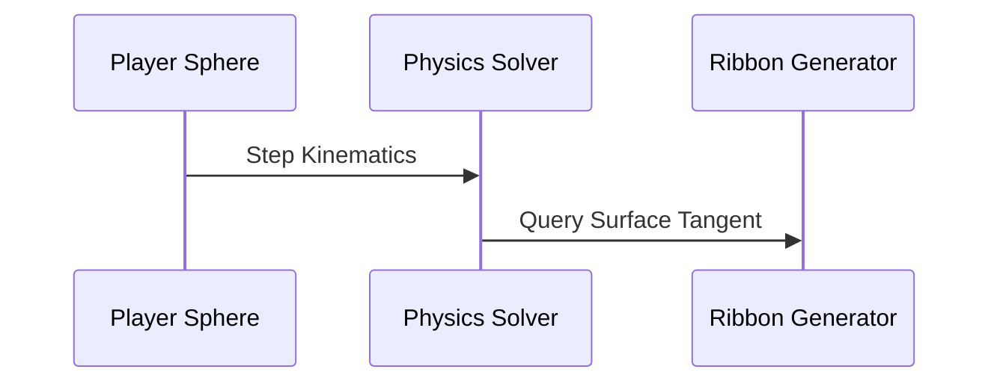
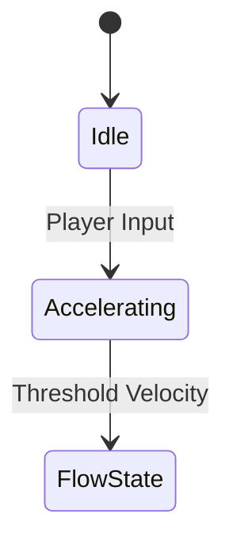

# [System Name] Specification

## 1. Objective
[Concise description of what this specification accomplishes.]

## 2. Design Philosophy
[Core design principles, luminous minimalism alignment, and user experience goals.]

## 3. Current Repository State
- **Completed**: [Functionality already implemented]
- **Partial**: [Partially implemented features]
- **Missing**: [Features yet to be created]
- **Technical Debt**: [Known tech debt or refactoring targets]
- **Dependencies**: [Internal and external dependencies]

## 4. Desired Final Implementation
[Detailed description of the target state upon specification completion.]

## 5. Technical Architecture
### Equations
$$ [LaTeX Mathematical Model] $$

### Coordinate Systems
[3D World Space vs Screen Space vs Local Tangent Space]

### Timing Diagrams


### State Machines


### Pseudocode
```typescript
function executeSystem(delta: number): void {
  // Pseudocode implementation logic
}
```

### Complexity Analysis
- Time Complexity: $O(1)$ per frame.
- Memory Complexity: $O(0)$ (Zero allocation per frame).

## 6. Files to Inspect
- `[path/to/file1.ts]`

## 7. Files to Modify
- `[path/to/file2.ts]`

## 8. Files Never Modify
- `frontend/src/core/physics/movement-engine.ts` (Protected Core)

## 9. Acceptance Criteria
- [ ] Criterion 1
- [ ] Criterion 2

## 10. Performance Budgets
- Target FPS: 60 FPS
- Memory: < 150 MB RAM
- VRAM: < 100 MB VRAM
- CPU Time: < 2.0 ms / frame
- Draw Calls: < 40 calls
- Load Times: < 1.5 seconds

## 11. Mobile Constraints
[Thermal throttling limits, touch gesture boundaries, screen aspect ratio scaling.]

## 12. Edge Cases
[Boundary conditions, lost WebGL context, zero velocity edge cases.]

## 13. Future Extensibility
[Hooks for liveops, seasonal biomes, or multiplayer synchronization.]

## 14. Executable Agent Prompt
```text
Goal: [Execution goal]
Context: [Key context]
Repository State: [Current state]
Read First: FLOWSTATE_MASTER_GUIDE/99_PROJECT_MEMORY/DECISION_LOG.md
Files to Inspect: [Files]
Files to Modify: [Files]
Files Never Modify: [Files]
Implementation Plan: [Step by step plan]
Constraints: 60 FPS target, 0-byte frame allocation.
Acceptance Tests: npm run typecheck
Completion Checklist: 10-Point AI Quality Gate verified.
```
